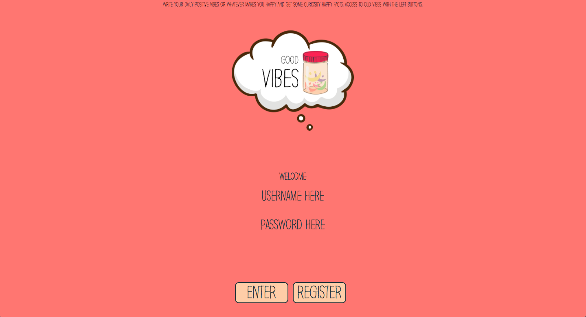
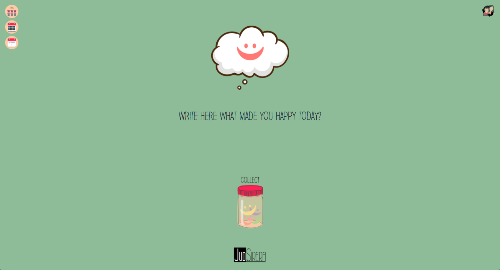
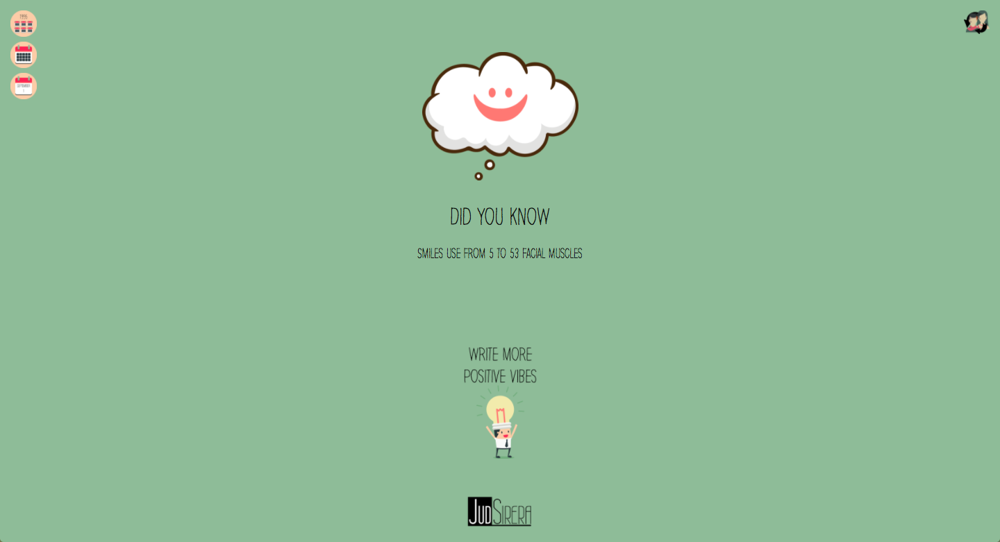
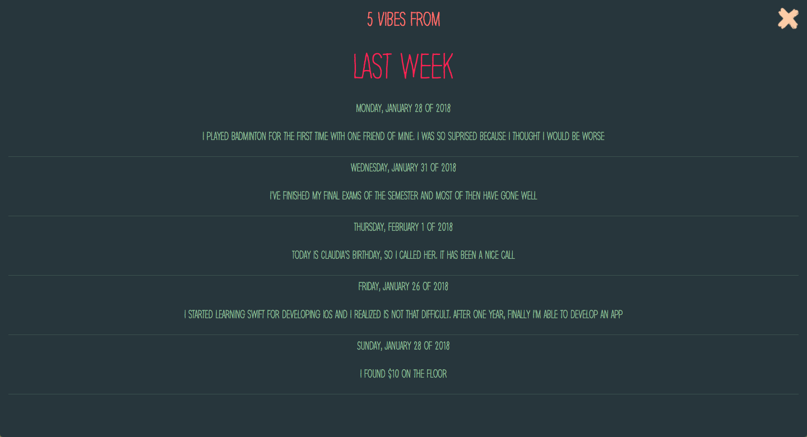

# Vibes
Based on the saying
> “Think positive and good things will happen”

The goal of the app is to engage the user to train his brain to think positive. Good Vibes helps you on this training by collecting the happy moments you had during the day. It can go from a funny word you listened to a big experience. For each Vibe, the app will propose some interesting facts related to happiness so the app can make you smile as well. Also, access and take a look at what you wrote in the last week, month or year.

I believe after a few days exercising your mind with good vibes is gonna be easier to see the world with positive eyes.

[Start now](https://judsirera.github.io/Vibes/)

# Firebase Configuration
Before starting you need to link this app to your firebase app. You just need to write you firebase app configuration parameters where the following code in [firebase-manajer.js](../blob/master/js/firebase-manajer.js):

```javascript
  config: {
    apiKey: YOUR_FIREBASE_APP_APIKEY,
    authDomain: YOUR_FIREBASE_APP_AUTH_DOMAIN,
    databaseURL: YOUR_FIREBASE_APP_DATABASE_URL,
    projectId: YOUR_FIREBASE_APP_PROJECT_ID,
    storageBucket: YOUR_FIREBASE_APP_STORE_BUCKET,
    messagingSenderId: YOUR_FIREBASE_APP_MESSAGING_SENDER_ID
  }
```
These parameters are given by firebase when you [create a project in their console](https://console.firebase.google.com/)

## Images





